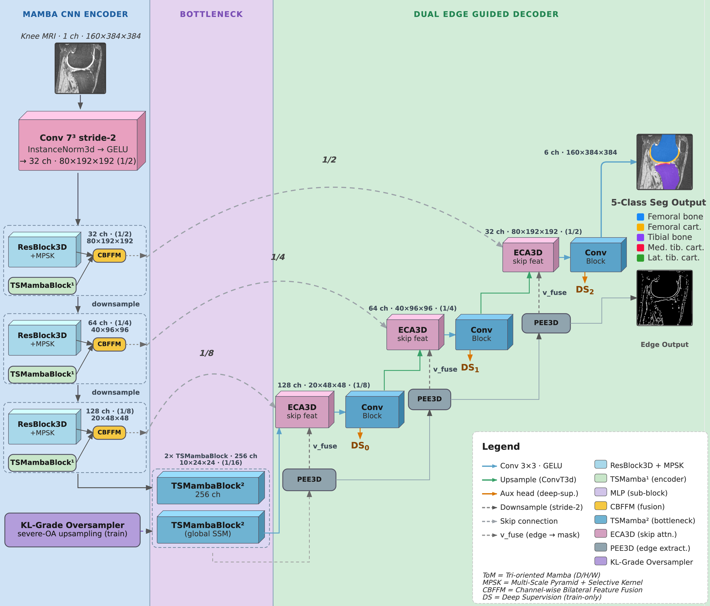
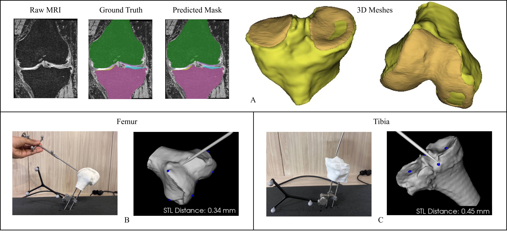

# MBEDNet — A Mamba–CNN Network with Dual Edge-Guided Decoders

3D segmentation of the tibiofemoral joint (femoral bone, femoral cartilage, tibial bone,
and medial/lateral tibial cartilage) from knee MRI, built for image-based Total Knee
Arthroplasty (TKA) planning and patient-specific implant design.

Cartilage in the knee is only two to three voxels thick and sits at a low-contrast
interface against bone, which is where most volumetric segmentation networks lose
accuracy. MBEDNet addresses this by running a convolutional branch and a state-space
(Mamba) branch side by side in every encoder stage, and by decoding segmentation and
tissue boundaries in two parallel streams that exchange information at each level. The
result reaches state-of-the-art average Dice on OAIZIB-CM at **17.4 M parameters** —
between 1.3× and 5.5× smaller than the architectures it is compared against.

**Reported Dice (5-fold cross-validation):** femur 98.46 %, tibia 98.64 %,
femoral cartilage 89.03 %, tibial cartilage 86.29 % — 93.11 % average.

---

## Architecture



*Encoder stages run a convolutional (MPSK) branch and a tri-oriented state-space
(TSMamba) branch in parallel and merge them channel-wise. The dual decoder emits a
segmentation mask and a boundary map, with the boundary stream feeding the mask stream at
every level.*

### Input handling

The network consumes single-channel intensity-normalised volumes at the dataset's native
anisotropic spacing of 0.7 × 0.365 × 0.365 mm (depth × height × width). Training operates
on `64 × 192 × 192` sub-volumes cropped with a bias toward bone and cartilage so the thin
classes are not drowned out by background, and a KL-grade-aware weighted sampler
oversamples severe osteoarthritis cases so the model repeatedly sees osteophytic
morphology. At inference the full volume is rebuilt from overlapping patches combined by
Gaussian-weighted sliding-window aggregation.

### Mamba–CNN encoder

A `7³` stride-2 stem lifts the input to 32 channels at half resolution. Three encoder
stages (32 → 64 → 128 channels) then each process their input through two parallel
branches:

- **TSMamba branch** — a tri-oriented selective scan. The feature volume is swept three
  times, once along each spatial axis, with each sweep carrying selective state that
  decides what to keep and what to discard. The three passes are concatenated, mixed by a
  `1×1×1` convolution and instance-normalised. Splitting the scan across axes keeps the
  cost at `O(D + H + W)` per pass, as opposed to the `O((D·H·W)²)` of full 3D
  self-attention.
- **MPSK branch** — three parallel 3D convolutions with `1³`, `3³` and `5³` kernels,
  weighted per channel by a learned selective-kernel gate, so the layer can lean on small
  kernels for thin cartilage texture and large kernels for bulk bone context. Pyramid
  pooling at 2×2, 4×4 and 8×8 grids supplies additional multi-scale context, and both
  paths are added back onto the stage input through residual connections.

The two branch outputs are joined by the **CBFFM** fusion module: concatenate, project
with a `1×1×1` convolution followed by GELU and instance norm, then rescale channels by a
squeeze-and-excitation gate. The fused tensor serves double duty as the encoder skip
connection and, after a stride-2 channel-doubling convolution, as the next stage's input.
Three stages later this yields a 256-channel bottleneck at 1/16 resolution, where two
stacked TSMamba blocks model relations that no local receptive field can reach — such as
the relative alignment of femur and tibia.

### Dual decoder with vertical cross-task fusion

The bottleneck initialises two level-aligned decoders that both run for three upsampling
stages:

- The **mask stream** upsamples with a stride-2 transposed convolution, concatenates the
  matching encoder skip after recalibration by an **ECA** gate, and refines the result
  through two `3×3×3` convolution + instance-norm + GELU blocks.
- The **boundary stream** upsamples the same way but concatenates the *raw* skip, since
  channel gating would suppress exactly the high-frequency content the edge extractor
  needs. It then passes through a **Progressive Edge Extractor (PEE)**, which subtracts
  3D average-pooled low-pass responses (kernels 3 and 5) from a squeezed feature map to
  expose scale-specific unsharp detail, biasing the stream toward the low-contrast
  bone–cartilage interface.

At each level the boundary features are injected into the mask stream in one direction
only — edge to mask — via a `1×1×1` convolution and GELU. The fused tensor is what
propagates to the next stage, so the semantic decoder stays boundary-aware throughout
rather than treating edges as an independent side prediction. Every stage also emits a
deep-supervision head that is upsampled to full resolution. After the final stage, the
mask and edge features are projected to 6-class and single-channel logits and interpolated
×2 to undo the stride-2 stem.

### Cartilage-aware composite loss

```
L = α · L_Dice  +  (1 − α) · L_CE  +  λ_E · L_Edge  +  L_deep
```

- **`L_Dice`** — class-weighted Dice with fixed per-class weights (`[0.01, 3, 4, 3, 6, 5]`
  for background, femoral bone, femoral cartilage, tibial bone, medial and lateral tibial
  cartilage), so errors on the small cartilage classes are penalised hardest.
- **`L_CE`** — distance-weighted cross-entropy. Weights are recomputed per sample from a
  Euclidean distance transform, exponentially upweighting voxels sitting on the
  bone–cartilage interface, with a tighter falloff for cartilage classes than for bone.
- **`L_Edge`** — binary cross-entropy (`λ_E = 0.1`) against ground-truth edges derived
  internally by morphological erosion of each foreground class, balanced against the
  sparsity of edge voxels.
- **`L_deep`** — deep supervision on the intermediate mask heads with decaying weights
  (`0.4, 0.2, 0.1`) so gradients are not diluted across the upsampling stages.

`α` is scheduled from 0.9 down to 0.55 over training (0.005 per epoch), shifting emphasis
from region overlap toward voxel-level boundary correctness as training progresses.

---

## Results

### Comparison against published baselines

Baseline numbers are reproduced from the MSPF-VM-Unet study (200 epochs, 5-fold CV on
OAIZIB); MBEDNet is evaluated under its own 5-fold cross-validation on OAIZIB-CM. Dice, %.

| Method | Params | FB | TB | FC | TC | Avg |
|---|---:|---:|---:|---:|---:|---:|
| U-Net | 31.0 M | 96.43 | 96.05 | 84.73 | 83.21 | 90.11 |
| V-Net | 71.0 M | 97.04 | 96.52 | 87.75 | 84.09 | 91.35 |
| nnU-Net | 30.0 M | 97.87 | 97.17 | 88.51 | 85.49 | 92.26 |
| I-Mask-RCNN | 44.0 M | 97.60 | 97.53 | 83.32 | 80.67 | 89.78 |
| SwinUNETR | 62.2 M | 98.46 | 98.47 | 87.77 | 84.47 | 92.29 |
| MtRA-Unet | 96.5 M | 98.53 | 98.44 | 89.19 | 86.02 | 93.05 |
| VM-UNet | 27.0 M | 97.35 | 96.31 | 85.33 | 83.17 | 90.54 |
| MSPF-VM-Unet | 22.7 M | 98.61 | 98.37 | 89.57 | 85.63 | 93.05 |
| **MBEDNet (ours)** | **17.4 M** | 98.46 | **98.64** | 89.03 | **86.29** | **93.11** |

FB = femoral bone, TB = tibial bone, FC = femoral cartilage, TC = tibial cartilage
(the mean of medial and lateral). MBEDNet matches the larger MSPF-VM-Unet using 23 % fewer
parameters, and its cartilage-focused training buys roughly 1–2 % on cartilage over
SwinUNETR. Note the split differs between the two sets of numbers (baselines 70/20/10,
MBEDNet 65/15/20), so this is a comparison under similar rather than identical conditions.
No significance testing is claimed across these rows, because per-case predictions under a
matched protocol are not available for the reproduced baselines.

### Ablation

Averaged over the five foreground classes.

| Configuration | DSC (%) | HD95 (mm) | ASSD (mm) |
|---|---:|---:|---:|
| w/o Mamba branch | 89.80 | 1.44 | 0.400 |
| w/o Edge decoder | 90.70 | 1.29 | 0.360 |
| w/o Bottleneck (Mamba → conv) | 91.00 | 1.14 | 0.330 |
| w/o Edge loss | 91.60 | 1.03 | 0.310 |
| **Full model** | **92.00** | **0.95** | **0.289** |

Dropping the Mamba branch hurts most, which says global context genuinely matters for
joint-level segmentation. Dropping the edge decoder shows up primarily in HD95 — a
boundary metric — consistent with its role in holding thin cartilage surfaces together.
Performance comes from the combination rather than from any one component.

### Performance by Kellgren–Lawrence grade

Of 102 test cases, 7 carry no KL grade and are excluded from the per-grade rows.

| KL | n | FB | TB | FC | TC | Avg DSC | HD95 (mm) | ASSD (mm) |
|---:|---:|---:|---:|---:|---:|---:|---:|---:|
| 0 | 20 | 98.76 | 98.82 | 88.62 | 85.99 | 93.05 | 0.73 | 0.149 |
| 1 | 12 | 98.74 | 98.71 | 89.74 | 88.06 | 93.81 | 0.70 | 0.141 |
| 2 | 21 | 98.59 | 98.62 | 88.48 | 86.92 | 93.15 | 0.79 | 0.151 |
| 3 | 27 | 98.58 | 98.66 | 88.88 | 84.84 | 92.74 | 0.82 | 0.167 |
| 4 | 15 | 98.64 | 98.39 | 88.77 | 82.93 | 92.18 | 1.07 | 0.238 |
| **All** | **95** | 98.66 | 98.64 | 88.90 | 85.75 | 92.99 | 0.95 | 0.289 |

Scores stay high across disease severity, with a modest dip at KL grade IV where cartilage
loss is most advanced and occasional stray voxels appear near badly eroded interfaces.
Per-case Dice differences were assessed with a two-sided Wilcoxon signed-rank test paired
across test-fold cases, with Holm–Bonferroni correction for the per-structure comparisons
(corrected `p < 0.05` treated as significant).

---

## Clinical validation



*(A) Segmentation masks and the triangular meshes reconstructed from them; (B, C) optical
tracking of the 3D-printed femur and tibia phantoms against the predicted STL surface.*

Predicted masks for KL grade IV femora were assessed surgically rather than only
numerically, covering surface geometry, landmark consistency, registration and
intraoperative tracking:

- Predicted and ground-truth masks were converted to triangular meshes, and an in-house
  annotation module localised **eight clinically relevant femoral landmarks** across five
  KL grade IV test cases. The mean Euclidean landmark error averaged
  **0.964 ± 0.528 mm**.
- One randomly chosen test subject was **3D-printed as a physical phantom** and tracked in
  real time with an IR stereo camera and a blunt intraoperative probe. Predicted landmarks
  were registered to manually annotated landmarks in DRB space, giving a target
  registration error of **0.045 mm** on landmarks collected independently of the
  registration.
- Transforming the segmented STL by that registration, the tracked tool-tip distance to
  the registered bone surface came out at **0.395 mm** — comfortably inside published
  surgical navigation tolerances.

---

## Repository layout

```
assets/
  architecture.png          Figure 1 — network overview
  clinical-validation.png   Figure 2 — meshes, landmarks and phantom tracking
mbednet/
  config.py     Config dataclass, CV settings, KL-grade sampling weights
  modules.py    TriOrientatedMamba, TSMambaBlock, MPSK, CBFFM, ECA3D, PEE3D, ResBlock3D
  model.py      MbEdNet — stem, encoder, bottleneck, dual decoder, heads
  loss.py       MbEdLoss — weighted Dice + distance-weighted CE + edge BCE + deep sup.
  data.py       OAIZIBDataset, stratified CV splits, cartilage-biased cropping, augmentation
  metrics.py    Dice, HD/HD95/ASSD surface metrics, connected-component post-processing
  trainer.py    Training loop, EMA, AMP, sliding-window inference, checkpoint resume
train.py        CLI entry point for training one fold
evaluate.py     CLI entry point for evaluating a checkpoint on its held-out fold
```

---

## Getting started

### Clone

```bash
git clone https://github.com/Armaanmerc/MBEDNet.git
cd MBEDNet
```

### Install

```bash
pip install -r requirements.txt
```

A CUDA GPU is required — `mamba-ssm` and `causal-conv1d` have no CPU fallback. The
reported experiments were run on a single A100 80 GB.

### Dataset

Point the code at an OAIZIB-CM tree laid out as follows:

```
OAI-ZIB-CM/
  imagesTr/*_0000.nii.gz   labelsTr/*.nii.gz
  imagesTs/*_0000.nii.gz   labelsTs/*.nii.gz
  info/subInfo_train.csv   info/subInfo_test.csv
```

`imagesTr` and `imagesTs` are pooled into one set of 507 scans before splitting — the
original train/test partition is not reused. The `info/` CSVs supply the `CMT-ID` →
`KLGrade` mapping used both for stratifying the folds and for weighting the sampler.

Optional `.npy` sidecars (`<case>_0000.npy` next to the image, `<case>.npy` next to the
label) are picked up automatically and held in a shared RAM cache, which avoids repeated
decompression and network-filesystem round trips on every epoch. The path can also be set
once via the `OAIZIB_DATA_PATH` environment variable instead of `--data-path`.

Label indices: `0` background, `1` femoral bone, `2` femoral cartilage, `3` tibial bone,
`4` medial tibial cartilage, `5` lateral tibial cartilage.

### Train

```bash
python train.py --fold 0 --data-path /path/to/OAI-ZIB-CM
```

Run folds 0 through 4 to complete the cross-validation. Each run writes two files into
`checkpoints/fold{n}/`:

- `best_checkpoint.pth` — EMA weights at the best validation macro-Dice
- `checkpoint_latest.pth` — full state (optimiser, scaler, EMA shadow, loss schedule) for
  restart-safe resumption

Training resumes automatically from `checkpoint_latest.pth` if it is present, so an
interrupted run can simply be relaunched with the same command. Per-validation macro-Dice
is appended to `checkpoints/fold{n}/val_metrics.jsonl`.

Additional flags: `--checkpoint-dir`, `--epochs` (default 200), `--num-workers`
(default 16).

### Evaluate

```bash
python evaluate.py \
    --checkpoint checkpoints/fold0/best_checkpoint.pth \
    --fold 0 \
    --data-path /path/to/OAI-ZIB-CM \
    --out results_fold0.json
```

Reports per-structure and macro DSC, HD, HD95 and ASSD on the held-out test fold, under
both the 5-class setting and the 4-class setting where medial and lateral tibial cartilage
are merged. Largest-connected-component filtering is applied to predictions before
scoring. `--out` optionally dumps the same numbers as JSON.

---

## Configuration reference

Defaults live in [`mbednet/config.py`](mbednet/config.py) and can be overridden through
`make_config(**overrides)`.

**Cross-validation.** All 507 scans are pooled and split by
`StratifiedKFold(n_splits=5, shuffle=True, random_state=35)` stratified on KL grade. Each
fold's held-out 20 % is the test set; 15 % of the remainder becomes an inner validation
split used for model selection and early stopping. Every case appears in exactly one test
fold. The paper describes this as approximately a 65/15/20 split.

**Sampling and augmentation.** Each epoch draws two patches per training volume. Crops are
centred on cartilage 60 % of the time (weighted toward medial tibial, then lateral tibial,
then femoral cartilage, and retried until at least 200 cartilage voxels land in the
patch), on bone 25 % of the time, and placed at random otherwise. A `WeightedRandomSampler`
scales case-selection probability by KL grade (`0: 0.3, 1: 0.5, 2: 0.8, 3: 2.0, 4: 4.0`).
Intensities are normalised to the 1st–99th percentile range per volume. Augmentation
covers axis flips, elastic deformation (p = 0.3), rotation within ±15° (p = 0.3), gamma
adjustment in 0.7–1.5 (p = 0.3), intensity scale/shift and additive Gaussian noise.

**Optimisation.** AdamW at `1e-4` with cosine annealing to `1e-6` over 200 epochs, weight
decay `1e-5`, gradient clipping at 1.0, bfloat16 autocast, and an EMA of the weights with
decay 0.99 (EMA weights are what get validated and saved as best). Per-step batch size 4
with gradient accumulation over 2 steps gives an effective batch of 8; the paper's runs
used 2 × 4 for the same effective batch. Non-finite batches are retried in fp32 and
skipped if they still diverge.

**Validation and inference.** Validation runs every 10 epochs with early stopping after 60
epochs without improvement. Inference uses `64 × 192 × 192` sliding windows at 50 % overlap
along every axis, blended with a Gaussian window (`σ = 0.125 × patch`). Post-processing
keeps the largest connected component for each bone class and applies a single binary
closing pass to cartilage classes, filling only voxels that were background.

---

## Acknowledgement

This work was supported by the Ministry of Electronics and Information Technology (MeitY),
Government of India.

## Conflict of Interest

The authors declare no competing interests relevant to the content of this work.
